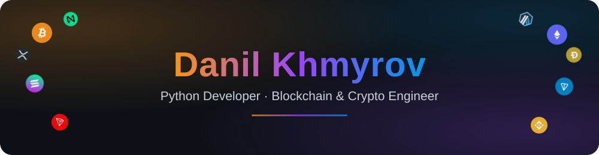

I'm a **Python developer with an engineering background**, specializing in **cryptocurrency and blockchain solutions** — from multi-chain wallet infrastructure to protocol-level tooling. Always open to new connections.

## ⛓️ Networks I Work With

## 🧰 Languages & Tools

## 📬 Connect

